Após a [explicação do conceito envolvendo Angular Elements (incluindo referências)](https://dev.to/wilmarques/angular-elements-introducao-351n), vou demonstrar como implementar um componente simples.

## O que será feito

Utilizaremos a [Angular CLI](https://angular.io/cli/) para criar uma aplicação e convertê-la para Angular Elements.

Teremos como base o exemplo disponível no [tutorial do Angular, Tour of Heroes](https://angular.io/tutorial).

Porém, para simplificar o processo, nesse primeiro momento criaremos apenas a listagem e adição de heróis, não o dashboard.

Nesse exemplo, uma aplicação Angular comum terá a responsabilidade de inclusão dos heróis, enquanto um Angular Elements exibirá a listagem.

Ilustração do que será construído:

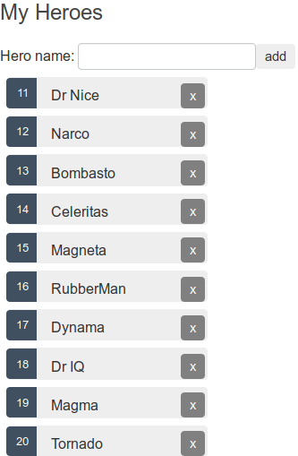

## Configuração do ambiente

Antes de tudo, devemos ter um ambiente corretamente configurado para o processo ocorrer conforme o esperado.

> Mais detalhes sobre a configuração do ambiente podem ser obtidos na [documentação oficial](https://angular.io/guide/setup-local).

### Node e NPM

A versão 10 do Node é a atualmente recomendada, tanto pelo Angular quanto pela própria equipe do Node.

Uma ótima opção para realizar a instalação é usar algum gerenciador, por exemplo [nvm](https://github.com/nvm-sh/nvm) ou [nvs](https://github.com/jasongin/nvs), porém o [site oficial](https://nodejs.org/) tem instruções para instalação em cada sistema operacional.

A vantagem em usar um gerenciador é a facilidade de atualização e possibilidade em se ter diferentes versões do Node em um mesmo equipamento.

> O Node 8 não é mais recomendado, principalmente por estar chegando no [fim do seu ciclo de vida](https://nodejs.org/en/about/releases/).

O [NPM](https://www.npmjs.com/) é instalado em conjunto com o Node, sendo 6 a [versão mais atual](https://github.com/npm/cli/releases).

### Angular CLI

Para instalar a Angular CLI, basta executar o seguinte comando na linha de comando:

```bash
npm install -g @angular/cli@^8
```

Após a instalação, execute esse comando para verificar o correto funcionamento:

```bash
ng version
```

Resultado do comando:

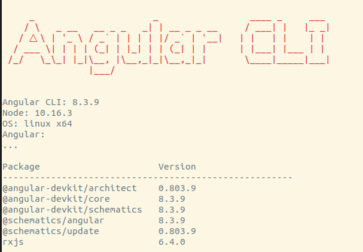

## Criação do projeto

### Workspace

A CLI do Angular possibilita a criação de diversos projetos dentro de um mesmo [workspace](https://angular.io/guide/glossary#workspace), para simplificar a criação de [monorepos](https://www.atlassian.com/git/tutorials/monorepos).

Para usufruirmos dessa funcionalidade, antes iniciaremos um workspace limpo (sem projetos) utilizando o comando [`ng new`](https://angular.io/cli/new):

```bash
ng new ng-elements --createApplication=false
```

### Aplicação inicial

Após o workspace ser criado, entraremos nele e adicionaremos uma aplicação simples com o seguinte:

```bash
cd ng-elements
ng generate application heroes-creator --minimal=true --prefix=hc --routing=false --style=css
```

> No comando acima, o parâmetro `--minimal=true` cria a aplicação sem a inicialização dos [testes unitários](https://angular.io/guide/testing) e [testes funcionais](https://angular.io/cli/e2e).
>
> O parâmetro `--prefix=hc` define _hc_ como prefixo para todos os componentes criados nessa aplicação, por exemplo `<hc-novo-heroi>`.
>
> `--routing=false` cria a aplicação sem [roteamento](https://angular.io/start/routing).
>
> Já `--style=css` cria o projeto sem um [pré-processador de CSS](https://tableless.com.br/pre-processadores-usar-ou-nao-usar/).

A execução do comando `ng generate` criará uma pasta _projects_, adicionará o projeto de nome _heroes-creator_ e alterará o arquivo `angular.json` com uma configuração para esse projeto especificamente.

Também modificará o arquivo `package.json` adicionando as dependências necessárias para a sua execução e as instalará.

Além disso, esse novo projeto passará a ser o padrão para qualquer comando executado neste workspace.

### Executando a aplicação

Após a aplicação ser criada, podemos executá-la com o seguinte comando:

```bash
ng serve
```

Tendo o seguinte resultado:

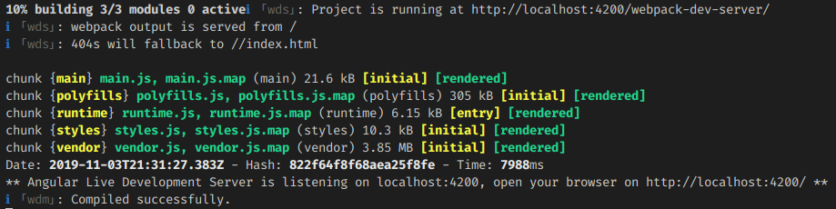

E com isso podemos abrir o endereço <http://localhost:4200/> no navegador e ver a aplicação em execução:


## Criação de heróis

### Componente principal

Agora que já temos uma aplicação (exemplo) funcional, podemos alterá-la para ficar de acordo com o esperado.

Todo o código dessa aplicação fica no diretório _src_ em _heroes_creator_, localizado na pasta _projects_, como a seguir:

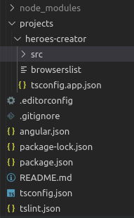

Dentro da pasta _src_, encontramos a _app_ onde está contido o componente e o módulo principal da aplicação, `app.component.ts` e `app.module.ts`:

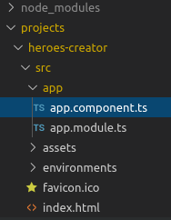

Antes de tudo, substituiremos o conteúdo do arquivo `app.module.ts` para:

```ts
import { BrowserModule } from '@angular/platform-browser';
import { NgModule } from '@angular/core';
import { FormsModule } from '@angular/forms';

import { AppComponent } from './app.component';

@NgModule({
  declarations: [
    AppComponent,
  ],
  imports: [
    BrowserModule,
    FormsModule,
  ],
  providers: [],
  bootstrap: [AppComponent],
})
export class AppModule { }
```

E o conteúdo do arquivo `app.component.ts` para:

```ts
import { Component } from '@angular/core';

@Component({
  selector: 'hc-root',
  template: `
    <h1>My Heroes</h1>
    <hc-creator (newHero)="addHero($event)"></hc-creator>
    <ul>
      <li *ngFor="let hero of heroes">
        {{ hero }}
      </li>
    </ul>
  `,
})
export class AppComponent {

  heroes: Array<string> = [];

  addHero(newHero: string): void {
    this.heroes = [
      ...this.heroes,
      newHero,
    ];
  }

}
```

Prestando atenção ao código acima, podemos ver uma referência a um componente ainda não criado, `hc-creator`. O criaremos agora utilizando os comandos da Angular CLI:

```bash
ng generate component creator --inlineStyle=true --inlineTemplate=true --skipTests=true --flat=true
```

> Os parâmetros usados acima fazem com que apenas um arquivo seja criado, contendo o template e styles ao invés de arquivos separados para cada um.
>
> Também não serão criados testes unitários, além de o arquivo ser criado na raiz do projeto, ao invés de estar contido em uma pasta própria.
>
> Exemplo do resultado do comando sem os parâmetros:
>
> 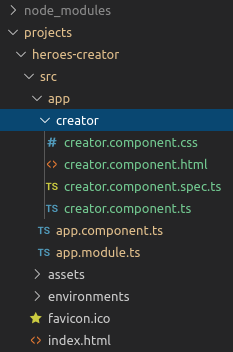
>
> Exemplo com os parâmetros:
>
> 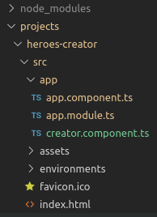

Após esse componente ser criado, mude o conteúdo do seu arquivo `creator.component.ts` para:

```ts
import { Component, Output, EventEmitter } from '@angular/core';

@Component({
  selector: 'hc-creator',
  template: `
    <div>
      <label>Hero name:
        <input #heroName />
      </label>
      <button (click)="add(heroName.value); heroName.value=''">
        add
      </button>
    </div>
  `,
  styles: [`
    button {
      background-color: #eee;
      border: none;
      padding: 5px 10px;
      border-radius: 4px;
      cursor: pointer;
      cursor: hand;
      font-family: Arial;
    }

    button:hover {
      background-color: #cfd8dc;
    }
  `]
})
export class CreatorComponent {

  @Output() newHero = new EventEmitter<string>();

  add(heroName: string): void {
    if (heroName) {
      this.newHero.emit(heroName);
    }
  }

}
```

Com isso, podemos executar o projeto:

```bash
ng serve
```

E visualizar o resultado no navegador:

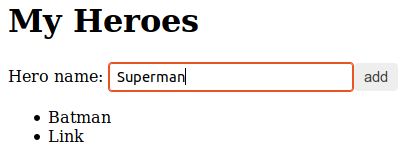

### Lista de heróis

Finalmente podemos iniciar a criação do componente usando [Angular Elements](https://angular.io/guide/elements).

Este componente receberá a lista de heróis contida no componente principal por parâmetro e a exibirá conforme a ilustração apresentada no início do artigo.

Antes de tudo, vamos criar um novo projeto no atual workspace, porém dessa vez criaremos uma [biblioteca](https://angular.io/guide/libraries) onde o componente ficará contido. Além de ser uma biblioteca e não uma aplicação, definemos o prefixo dos seus componentes como _hv_, a fim de diferenciarmos mais facilmente durante o desenvolvimento:

```bash
ng generate library heroes-visualizer --prefix=hv
```

Após a execução do comando acima, o projeto será criado na pasta _projects_ e o arquivo `angular.json` será modificado adicionando uma nova configuração específica para ele. Como podemos ver a seguir:

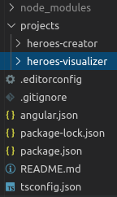

A CLI do Angular ainda não nos dá opção de gerar bibliotecas com uma configuração mínima, semelhante ao que fizemos com a aplicação inicial. Portanto vamos excluir os seguintes arquivos desnecessários:

- projects/heroes-visualizer/src/lib/heroes-visualizer.component.spec.ts
- projects/heroes-visualizer/src/lib/heroes-visualizer.service.ts
- projects/heroes-visualizer/src/lib/heroes-visualizer.service.spec.ts

> Como não realizaremos qualquer tipo de teste, poderíamos excluir os arquivos `karma.conf.js` e `src/test.ts`, além de remover a [configuração para execução de testes](https://angular.io/guide/workspace-config#configuring-builder-targets).
>
> Porém em nada atrapalharão e não nos preocuparemos para não prolongar o artigo.

> Como utilizo [Ubuntu](https://ubuntu.com/), executo o seguinte comando no [Bash](https://en.wikipedia.org/wiki/Bash_(Unix_shell)) para excluir os arquivos:
>
> `rm -rf projects/heroes-visualizer/src/lib/heroes-visualizer.service.ts projects/heroes-visualizer/src/lib/*.spec.ts`
>
> Caso utilize outro Sistema Operacional, o comando pode variar.

Após a exclusão desses arquivos, vamos alterar o conteúdo do arquivo `public-api.ts` presente na pasta `projects/heroes-visualizer/src/` para:

```ts
/*
 * Public API Surface of heroes-visualizer
 */

export * from './lib/heroes-visualizer.component';
export * from './lib/heroes-visualizer.module';
```

Com isso, podemos utilizar na aplicação principal (_heroes-creator_) o componente previamente criado nesta biblioteca, modificando o arquivo `projects/heroes-creator/src/app/app.module.ts` para:

```ts
import { BrowserModule } from '@angular/platform-browser';
import { NgModule } from '@angular/core';
import { FormsModule } from '@angular/forms';

import { AppComponent } from './app.component';
import { CreatorComponent } from './creator.component';

import { HeroesVisualizerModule } from 'heroes-visualizer';

@NgModule({
  declarations: [
    AppComponent,
    CreatorComponent,
  ],
  imports: [
    BrowserModule,
    FormsModule,
    HeroesVisualizerModule,
  ],
  providers: [],
  bootstrap: [AppComponent],
})
export class AppModule { }
```

E o arquivo `projects/heroes-creator/src/app/app.component.ts` para:

```ts
import { Component } from '@angular/core';

@Component({
  selector: 'hc-root',
  template: `
    <h1>My Heroes</h1>
    <hc-creator (newHero)="addHero($event)"></hc-creator>
    <ul>
      <li *ngFor="let hero of heroes">
        {{ hero }}
      </li>
    </ul>
    <hv-heroes-visualizer></hv-heroes-visualizer>
  `,
})
export class AppComponent {

  heroes: Array<string> = [];

  addHero(newHero: string): void {
    this.heroes = [
      ...this.heroes,
      newHero,
    ];
  }

}
```

Assim, podemos executar o projeto para verificar o resultado no navegador, mas antes precisamos [compilar a biblioteca](https://angular.io/guide/creating-libraries#using-your-own-library-in-apps) com o comando:

```bash
ng build heroes-visualizer
```

Dessa forma, ao executar o projeto (`ng serve`) temos o seguinte resultado no navegador:

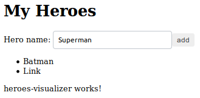

Agora vamos modificar alguns arquivos para transferir a exibição dos heróis para o componente `hv-heroes-visualizer`, além de já implementarmos uma funcionalidade de remoção de determinados heróis.

Primeiramente, altere o conteúdo do arquivo `projects/heroes-visualizer/src/lib/heroes-visualizer.component.ts` para:

```ts
import { Component, Output, EventEmitter, Input } from '@angular/core';

@Component({
  selector: 'hv-heroes-visualizer',
  template: `
    <ul class="heroes">
      <li *ngFor="let hero of heroes">
        <span class="badge">{{hero.id}}</span>
        <span class="hero-name">{{ hero }}</span>
        <button class="delete" title="delete hero"
          (click)="delete(hero)">x</button>
      </li>
    </ul>
  `,
  styles: [`
    .heroes {
      margin: 0 0 2em 0;
      list-style-type: none;
      padding: 0;
      width: 15em;
    }
    .heroes li {
      position: relative;
      cursor: pointer;
      background-color: #EEE;
      margin: .5em;
      padding: .5em 0 .3em 1em;
      height: 1.6em;
      border-radius: 4px;
    }
    .heroes li:hover {
      color: #607D8B;
      background-color: #DDD;
      left: .1em;
    }

    .heroes span.hero-name {
      color: #333;
      position: relative;
      display: block;
      width: 250px;
    }
    .heroes span.hero-name:hover {
      color:#607D8B;
    }

    button {
      background-color: #eee;
      border: none;
      padding: 5px 10px;
      border-radius: 4px;
      cursor: pointer;
      cursor: hand;
      font-family: Arial;
    }
    button.delete {
      position: relative;
      left: 174px;
      top: -23px;
      background-color: gray !important;
      color: white;
    }
  `]
})
export class HeroesVisualizerComponent {

  @Input() heroes: Array<string>;

  @Output() deleteHero = new EventEmitter<string>();

  delete(heroName: string): void {
    if (heroName) {
      this.deleteHero.emit(heroName);
    }
  }

}
```

Do arquivo `projects/heroes-visualizer/src/lib/heroes-visualizer.module.ts` para:

```ts
import { NgModule } from '@angular/core';
import { CommonModule } from '@angular/common';
import { FormsModule } from '@angular/forms';

import { HeroesVisualizerComponent } from './heroes-visualizer.component';

@NgModule({
  declarations: [HeroesVisualizerComponent],
  imports: [
    CommonModule,
    FormsModule,
  ],
  exports: [HeroesVisualizerComponent],
})
export class HeroesVisualizerModule { }
```

Do arquivo `projects/heroes-creator/src/app/app.component.ts` para:

```ts
import { Component } from '@angular/core';

@Component({
  selector: 'hc-root',
  template: `
    <h1>My Heroes</h1>
    <hc-creator (newHero)="addHero($event)"></hc-creator>
    <hv-heroes-visualizer [heroes]="heroes" (deleteHero)="deleteHero($event)"></hv-heroes-visualizer>
  `,
})
export class AppComponent {

  heroes: Array<string> = [];

  addHero(newHero: string): void {
    this.heroes = [
      ...this.heroes,
      newHero,
    ];
  }

  deleteHero(heroToDelete: string): void {
    this.heroes = this.heroes.filter((hero: string) => {
      return hero !== heroToDelete;
    });
  }

}
```

E do arquivo `projects/heroes-creator/src/app/app.module.ts` para:

```ts
import { BrowserModule } from '@angular/platform-browser';
import { NgModule } from '@angular/core';
import { FormsModule } from '@angular/forms';

import { AppComponent } from './app.component';
import { CreatorComponent } from './creator.component';

import { HeroesVisualizerModule } from 'heroes-visualizer';

@NgModule({
  declarations: [
    AppComponent,
    CreatorComponent,
  ],
  imports: [
    BrowserModule,
    FormsModule,
    HeroesVisualizerModule,
  ],
  providers: [],
  bootstrap: [AppComponent],
})
export class AppModule { }
```

Agora podemos compilar novamente a biblioteca (`ng build heroes-visualizer`) e executar o projeto principal (`ng serve`), tendo o seguinte resultado:

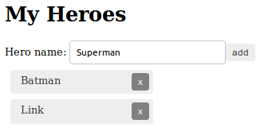

## Convertendo lista de heróis em Angular Elements

Até agora, criamos um projeto principal sendo uma aplicação Angular _comum_ e uma _bibliote
ca de componentes_ onde a listagem dos heróis está contida.

Porém até o momento, não temos qualquer utilização de Angular Elements em qualquer desses p
rojetos. E será isso que faremos agora, convertendo a biblioteca `heroes-visual
izer` em Angular Elements.

Primeiramente, devemos adicionar o suporte a Angular Elements ao projeto principal, já que ele será o responsável por exibir o componente exportado como tal. Para isso, basta executar o comando:

```bash
ng add @angular/elements
```

Esse comando adiciona o [polyfill de Custom Elements](https://github.com/WebReflection/document-register-element) e o pacote [@angular/elements](https://www.npmjs.com/package/@angular/elements) ao workspace.

Vamos alterar o arquivo `projects/heroes-visualizer/src/lib/heroes-visualizer.module.ts` para o seguinte:

```ts
import { NgModule } from '@angular/core';
import { CommonModule } from '@angular/common';
import { FormsModule } from '@angular/forms';

import { HeroesVisualizerComponent } from './heroes-visualizer.component';

@NgModule({
  declarations: [HeroesVisualizerComponent],
  imports: [
    CommonModule,
    FormsModule,
  ],
  entryComponents: [HeroesVisualizerComponent],
})
export class HeroesVisualizerModule { }
```

A alteração diz respeito a remover o componente dessa biblioteca da listagem de `exports` para `entryComponents`, a fim de este não fazer parte da compilação principal da aplicação, já que iremos utilizá-lo como um Angular Elements.

Agora precisamos registrar esse componente como um Custom Element, utilizando as APIs providas pelo pacote `@angular/elements`, mais especificamente o método [`createCustomElement`](https://angular.io/api/elements/createCustomElement).

Esse registro será realizado no componente principal da aplicação, alterando o arquivo `projects/heroes-creator/src/app/app.component.ts` para o seguinte:

```ts
import { Component, Injector, OnInit } from '@angular/core';
import { createCustomElement } from '@angular/elements';

import { HeroesVisualizerComponent } from 'heroes-visualizer';

@Component({
  selector: 'hc-root',
  template: `
    <h1>My Heroes</h1>
    <hc-creator (newHero)="addHero($event)"></hc-creator>
    <hvce-heroes-visualizer [heroes]="heroes" (deleteHero)="deleteHero($event.detail)"></hvce-heroes-visualizer>
  `,
})
export class AppComponent implements OnInit {

  heroes: Array<string> = [];

  constructor(
    private injector: Injector,
  ) { }

  ngOnInit(): void {
    const HeroesVisualizerElementDefinition = createCustomElement(
      HeroesVisualizerComponent,
      { injector: this.injector },
    );
    customElements.define('hvce-heroes-visualizer', HeroesVisualizerElementDefinition);
  }

  addHero(newHero: string): void {
    this.heroes = [
      ...this.heroes,
      newHero,
    ];
  }

  deleteHero(heroToDelete: string): void {
    this.heroes = this.heroes.filter((hero: string) => {
      return hero !== heroToDelete;
    });
  }

}
```

A mudança no componente acima se deu para usarmos a função `createCustomElement` do pacote `@angular/elements` para criar o que chamamos de _Element Definition_, ou o _constructor_, a ser utilizado pelo navegador para instanciar o que agora será basicamente um [Custom Element](https://developer.mozilla.org/en-US/docs/Web/Web_Components/Using_custom_elements).

Chamando essa função, o Angular cria a ponte entre as APIs nativas do navegador e as funcionalidades do próprio framework. Isso é necessário para ser possível utilizarmos funcionalidades como [data binding](https://angular.io/guide/template-syntax), por exemplo.

Com esse _Element Definition_ convertido e retornado pelo Angular, podemos o método [`customElements.define`](https://developer.mozilla.org/en-US/docs/Web/API/CustomElementRegistry/define) nativo do browser para que esse elemento seja devidamente registrado e disponível para ser usado na aplicação.

Esse método recebe 3 parâmetros, nome do elemento, _Element Definition_ (ou construtor) e um objeto de opções. Porém nesse exemplo só foi necessário o uso dos dois primeiros.

Na linha com o conteúdo `customElements.define('hvce-heroes-visualizer', HeroesVisualizerElementDefinition);` podemos ver esses dois parâmetros serem informados para o método `define`.

Também podemos ver o nome informado sendo `hvce-heroes-visualizer` ao invés do que estávamos usando anteriormente, `hv-heroes-visualizer`. Isso porque nesse momento o nome definido no componente Angular não será usado e podemos escolher qualquer outro para o navegador utilizar na definição de um Custom Element. Poderíamos ter usado o mesmo nome, mas para ilustração usamos um diferente.

Outra diferença de um componente Angular _comum_ é como recebemos os valores dos eventos disponibilizados neles através de [`Output`s](https://angular.io/api/core/Output).

No componente _comum_ recebíamos o valor apenas recuperando o objeto `$event`:

```html
<elemento (evento)="metodo($event)"></elemento>
```

Já com um Angular Element devemos utilizar a propriedade [`detail`](https://developer.mozilla.org/en-US/docs/Web/API/CustomEvent/detail) do evento, já que agora estamos lidando diretamente com [`Custom Event`s](https://developer.mozilla.org/en-US/docs/Web/API/CustomEvent/CustomEvent) que devem seguir a [especificação seguida pelos navegadores](https://dom.spec.whatwg.org/#dom-customeventinit-detail). Ficando assim:

```html
<elemento (evento)="metodo($event.detail)"></elemento>
```

Mesmo após essas mudanças, ao executarmos a aplicação recebemos o seguinte erro:

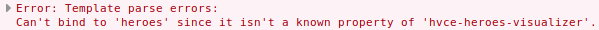

Isso acontece porque o Angular está tentando encontrar a propriedade desse elemento como se fosse um componente _comum_, mas ele deve ser tratado como um Custom Element. E para que isso ocorra conforme o esperado, devemos adicionar o `schema` `CUSTOM_ELEMENTS_SCHEMA` ao módulo principal da aplicação.

Logo, vamos alterar o conteúdo do arquivo `projects/heroes-creator/src/app/app.module.ts` para:

```ts
import { BrowserModule } from '@angular/platform-browser';
import { NgModule, CUSTOM_ELEMENTS_SCHEMA } from '@angular/core';
import { FormsModule } from '@angular/forms';

import { AppComponent } from './app.component';
import { CreatorComponent } from './creator.component';

import { HeroesVisualizerModule } from 'heroes-visualizer';

@NgModule({
  declarations: [
    AppComponent,
    CreatorComponent,
  ],
  imports: [
    BrowserModule,
    FormsModule,
    HeroesVisualizerModule,
  ],
  providers: [],
  bootstrap: [AppComponent],
  schemas: [
    CUSTOM_ELEMENTS_SCHEMA,
  ],
})
export class AppModule { }
```

Com isso corrigido, podemos compilar novamente a biblioteca (`ng build heroes-visualizer`) e executar a aplicação normalmente (`ng serve`) para vermos o resultado:

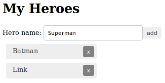

## Próximos passos

Essa foi uma implementação _padrão_ de Angular Elements, sem nenhuma customização e indo não muito além do apresentado diretamente na documentação do Angular.

Dessa forma, como pode ter reparado, mesmo que o componente possa ser considerado um Custom Element, ele ainda precisa ser compilado e disponibilizado em conjunto com a aplicação.

Mas endereçaremos esse assunto nos próximos artigos!

No mais, sintam-se livres a comentar e contribur positivamente!
